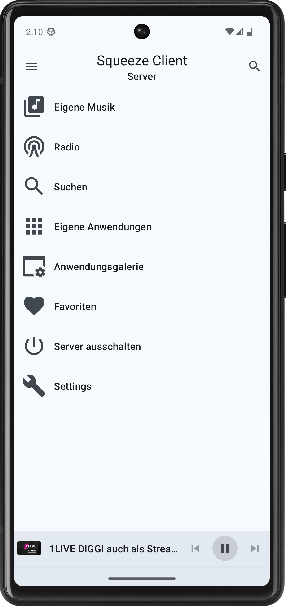
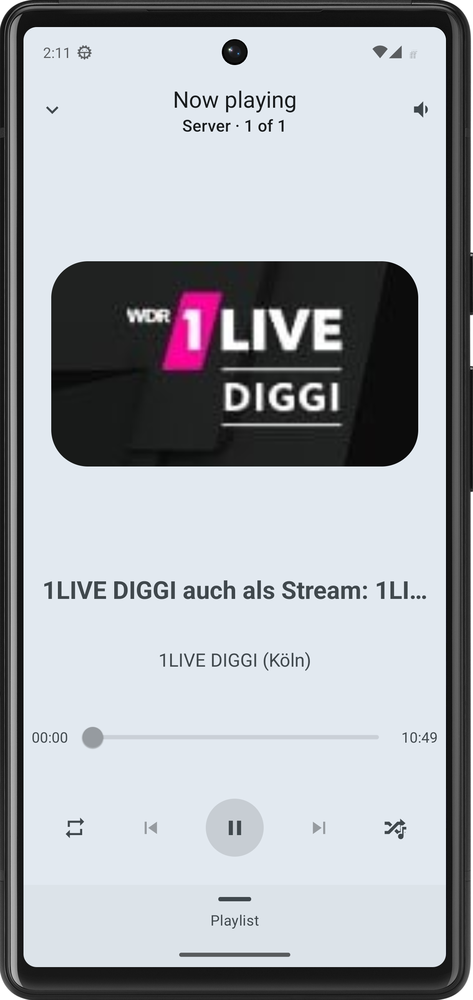
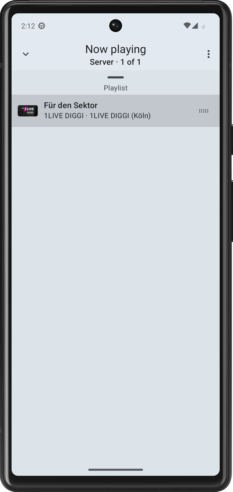
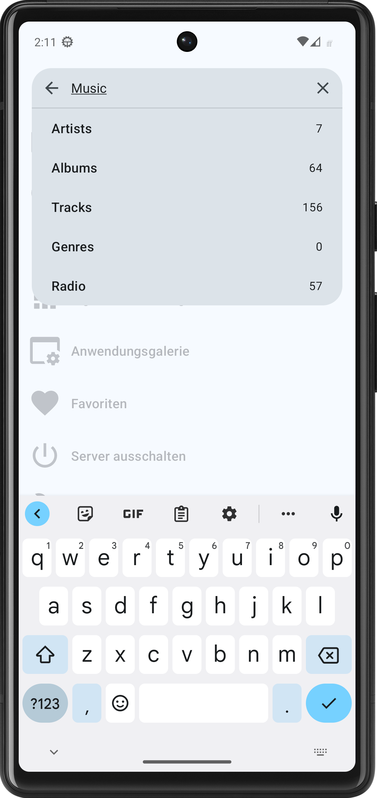
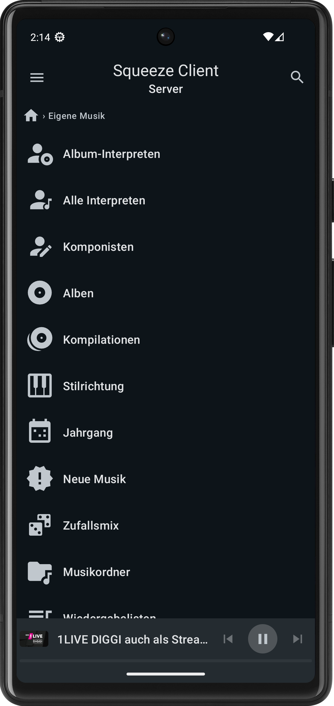
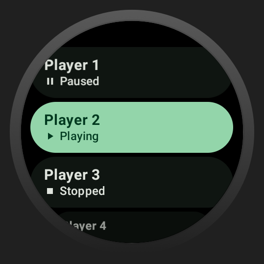

# Squeeze Client

An Android client/controller application for the [LMS music server](https://lms-community.github.io/) with Material Design 3 UI.

Or download the latest APK from the [Releases Section](https://github.com/maniac103/squeezeclient/releases/latest):

 * foss - FOSS is Free Open Source Software, without the need for proprietary third-party libs - suitable for most users
 * gms - Includes additional features for Wear support
 * wear - this is for installing onto a Google Wear smartwatch and offers more controls than the typical media play/pause/skip (for example, stop all players)

### Features:
- Music library browser
- Music library search quick access
- Playback and volume control
- Playlist management
- Multi-player management
- Music download
- Support for Light and dark theme as well as following system theme
- Full integration with system media controls, including playback control from Wear devices
- Companion app for Wear allowing playback start/stop, disconnecting system media controls and player selection

### Screenshots

