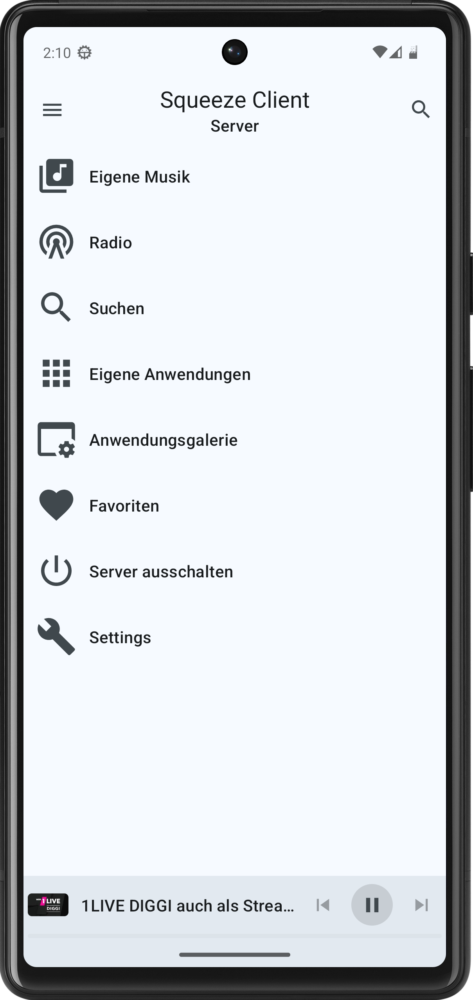

# Squeeze Client

An Android client/controller application for the [LMS music server](https://lms-community.github.io/) with Material Design 3 UI.

### Features:
- Music library browser
- Music library search quick access
- Playback and volume control
- Playlist management
- Multi-player management
- Music download
- Support for Light and dark theme as well as following system theme
- Full integration with system media controls, including playback control from Wear devices
- Companion app for Wear allowing playback start/stop, disconnecting system media controls and player selection

### Screenshots

